# 🏅 Kalis

Kalis est une application mobile de suivi et d'organisation de séances de callisthénie. Elle permet de gérer les figures à maîtriser, de planifier ses entraînements et de suivre sa progression grâce à un journal.

## ✨ Fonctionnalités

- **Figures** — Organisez vos figures en trois catégories : à apprendre, en apprentissage, et maîtrisées. Assignez une couleur à chaque figure et suivez les dates de début et de maîtrise.
- **Séance du jour** — Visualisez les figures prévues pour aujourd'hui, validez-les et ajoutez des notes de séance.
- **Planification** — Planifiez vos entraînements sur les 14 prochains jours en ajoutant les figures à travailler jour par jour.
- **Journal** — Gardez une trace de vos progrès grâce à des entrées de journal associées à chaque figure.
- **Synchronisation cloud** — Vos données sont synchronisées en temps réel via Firebase Firestore et accessibles sur tous vos appareils.

<table>
  <tr>
    <td>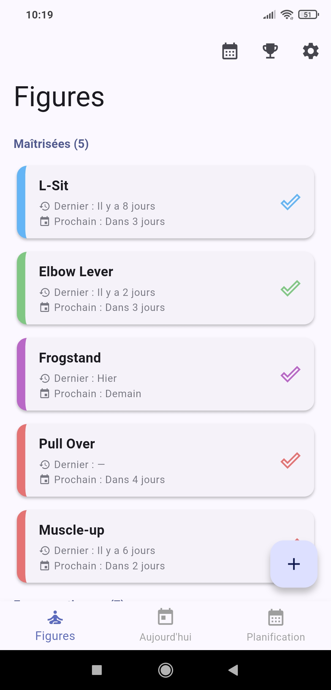</td>
    <td>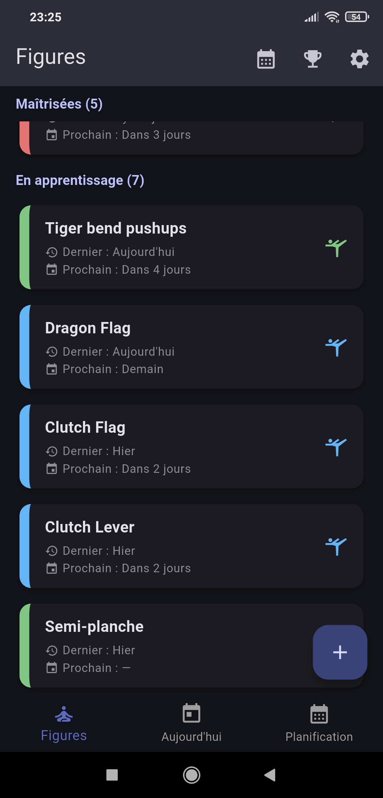</td>
    <td>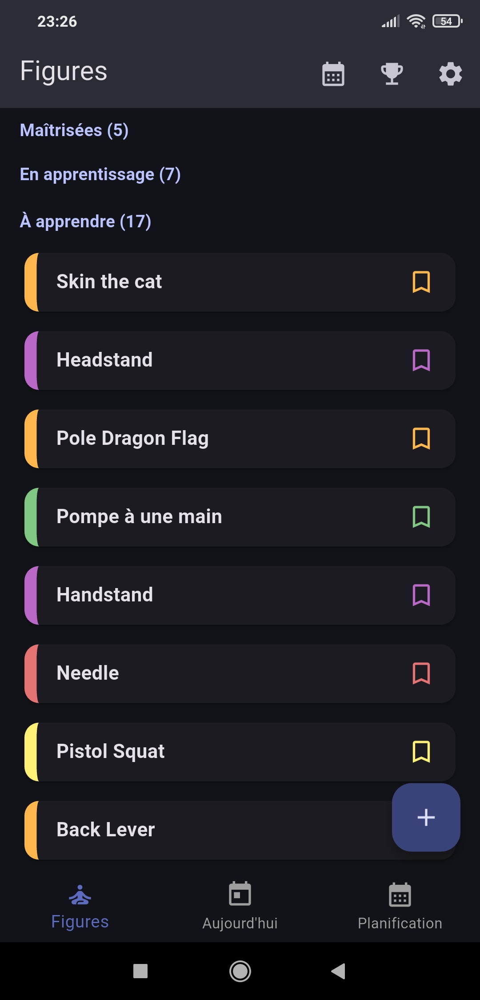</td>
    <td>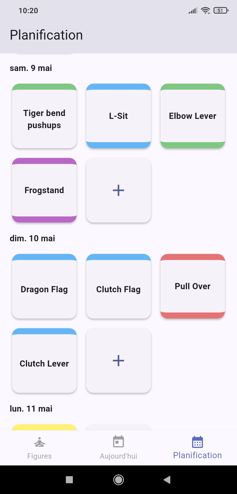</td>
    <td>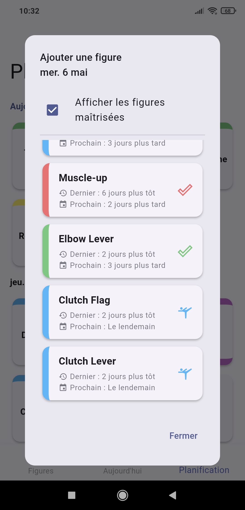</td>
  </tr>
  <tr>
    <td align="center">Figures maîtrisées</td>
    <td align="center">Figures en apprentissage</td>
    <td align="center">Figures à apprendre</td>
    <td align="center">Planification des séances</td>
    <td align="center">Ajout de figures à une séance</td>
  </tr>
  <tr>
    <td>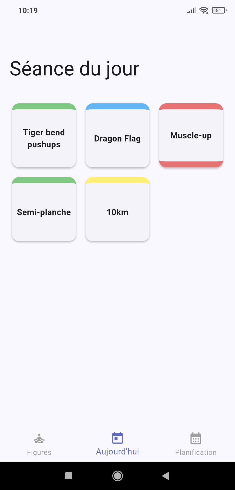</td>
    <td>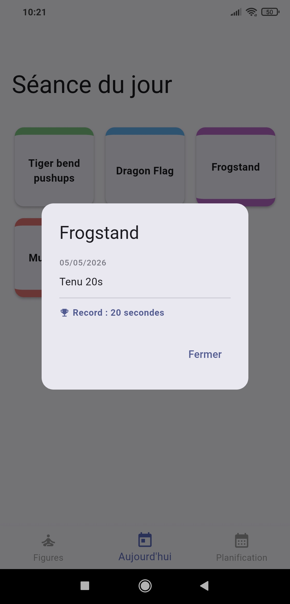</td>
    <td>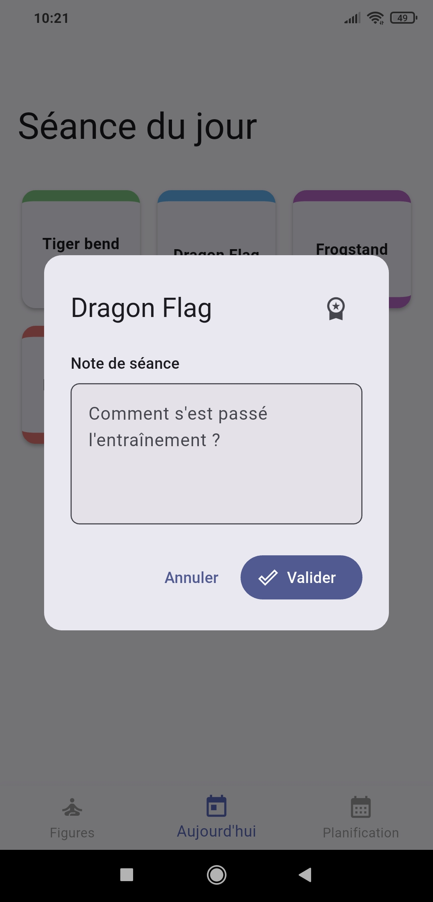</td>
    <td>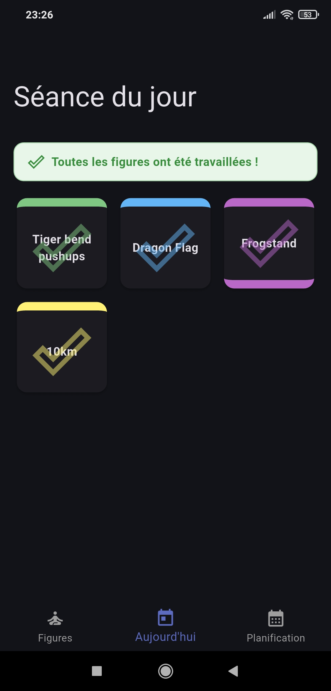</td>
  </tr>
  <tr>
    <td align="center">Séance du jour</td>
    <td align="center">Dernière entrée de journal</td>
    <td align="center">Validation de l'entraînement</td>
    <td align="center">Séance terminée</td>
  </tr>
  <tr>
    <td>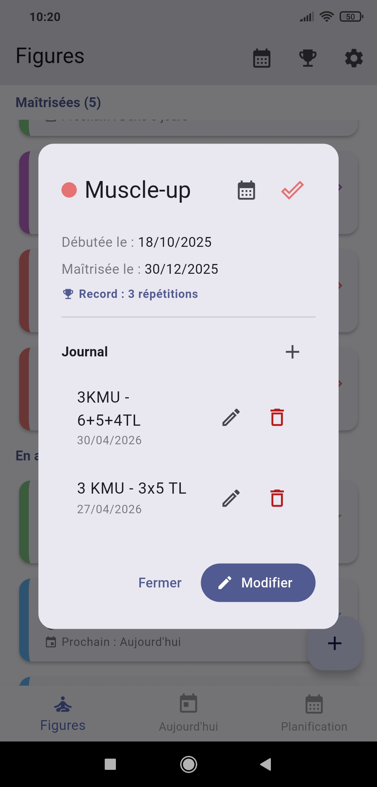</td>
    <td>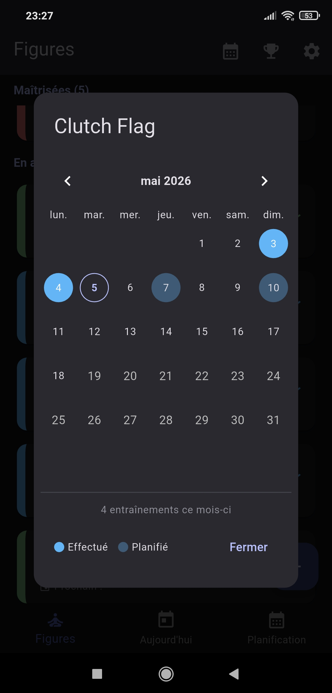</td>
    <td>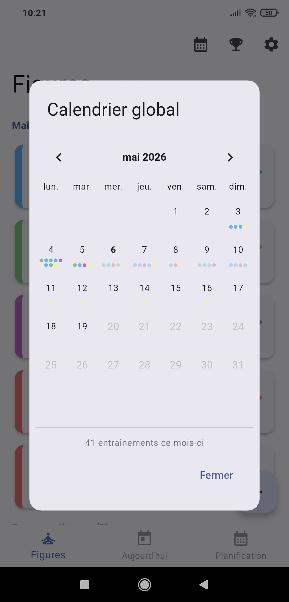</td>
    <td>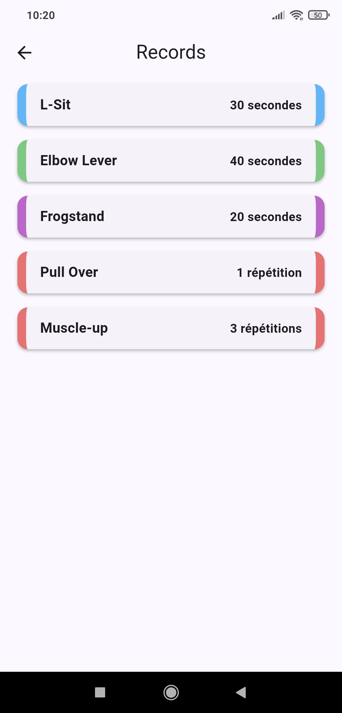</td>
  </tr>
  <tr>
    <td align="center">Détails sur la figure</td>
    <td align="center">Calendrier d'une figure</td>
    <td align="center">Calendrier des entraînements</td>
    <td align="center">Records</td>
  </tr>
</table>

## 🏗️ Stack technique

- [Flutter](https://flutter.dev/) — Framework mobile multiplateforme
- [Riverpod](https://riverpod.dev/) — Gestion d'état
- [Firebase Firestore](https://firebase.google.com/docs/firestore) — Base de données cloud en temps réel
- [Firebase Auth](https://firebase.google.com/docs/auth) — Authentification anonyme
- [go_router](https://pub.dev/packages/go_router) — Navigation
- [shared_preferences](https://pub.dev/packages/shared_preferences) — Persistance locale

## 🗃️ Architecture

Le projet suit un **Repository pattern** avec une séparation claire des responsabilités :

```
lib/
├── core/          # Thème, router, utilitaires
├── l10n/          # Fichiers de traduction (.arb)
├── models/        # Classes de données
├── providers/     # Providers Riverpod
├── repositories/  # Accès aux données Firestore
├── screens/       # Écrans et dialogs
└── widgets/       # Widgets réutilisables
```

## 🌐 Localisation

L'application est disponible pour l'instant uniquement en français. Les traductions sont gérées via le système officiel Flutter avec des fichiers `.arb`.

## 🚀 Installation

### Prérequis

- [Flutter](https://flutter.dev/docs/get-started/install) 3.x ou supérieur
- Un projet Firebase avec Firestore et Authentication activés

### Configuration Firebase

1. Créer un projet sur [console.firebase.google.com](https://console.firebase.google.com)
2. Activer **Firestore** et **Authentication** (mode anonyme)
3. Installer la FlutterFire CLI et lance :

```bash
flutterfire configure
```

### Lancer le projet

```bash
flutter pub get
flutter run
```

### Générer un APK

```bash
flutter build apk --release --split-per-abi
```

## 🔒️ Règles de sécurité Firestore

Les données de chaque utilisateur sont isolées grâce aux règles suivantes :

```
rules_version = '2';
service cloud.firestore {
    match /databases/{database}/documents {
        match /users/{userId}/{document=**} {
            allow read, write: if request.auth != null && request.auth.uid == userId;
        }
    }
}
```

## 📜 Licence

Ce projet est sous licence **MIT**.
Voir le fichier [LICENSE](LICENSE) pour plus de détails.